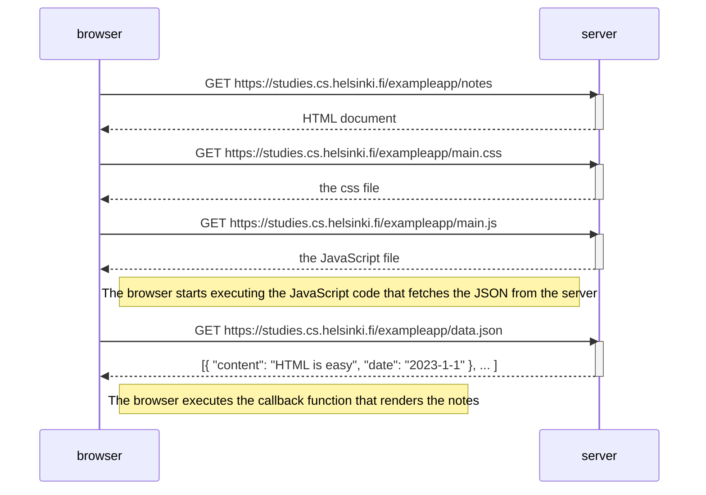

# README.md
 
# Contents

- [README.md](#readmemd)
  - [Notes](#notes)
    - [Fundamentals of Web Apps](#fundamentals-of-web-apps)
      - [HTTP Get](#http-get)
      - [Traditional web applications](#traditional-web-applications)
      - [Running the app logic in the Browser](#running-the-app-logic-in-the-browser)
      - [Event Handlers and Callback functions](#event-handlers-and-callback-functions)
      - [Document Object Model, or DOM](#document-object-model-or-dom)
      - [Manipulating the DOM from console](#manipulating-the-dom-from-console)
      - [CSS](#css)
      - [Loading a page containing Javascript - review](#loading-a-page-containing-javascript---review)
      - [Forms and HTTP POST](#forms-and-http-post)
      - [AJAX](#ajax)
      - [Single page app](#single-page-app)
      - [JavaScript-Libraries](#javascript-libraries)
      - [Full-stack web development](#full-stack-web-development)
      - [JavaScript fatigue](#javascript-fatigue)
    - [Exercises 0.1-0.6](#exercises-01-06)
      - [0.1 HTML](#01-html)
      - [0.2 CSS](#02-css)
      - [0.3 HTML forms](#03-html-forms)
      - [0.4: New note diagram](#04-new-note-diagram)
      - [0.5: Single page app diagram](#05-single-page-app-diagram)
      - [0.6: New note in Single page app diagram](#06-new-note-in-single-page-app-diagram)

## Notes

### Fundamentals of Web Apps

Examining this page: https://studies.cs.helsinki.fi/exampleapp/

First rule of web development: Always keep the Developer Console open.

`fn - f12` or `option-cmd-i`

In the network tab, there are options to disable caching, and hiding extension
URLs.

#### HTTP Get

The server and web browser communicate using HTTP protocol. 

When you refresh the page, two things happen:

- The browser has fetched the contents of the page from server
- And has downloaded the image kuva.png 

Network > Headers (After clicking on the first item in the list)

General shows how the browser interacted with the server: 
- Get request to URL and status of request

Response Headers show us:
- Content-length which is the size of the response in bytes
- Content-type shows us that it's a text files in UTF-8 and formatted with html 

Response tab, shows us the response data, which is a regular HTML page. 
- In the tab, we see that three is a img tag that causes the browser to fetch
  the image from the server. 

The chain of events:

Browser :: GET https://studies.cs.helsinki.fi/exampleapp/
Server  :: Returns html doc
Browser :: GET https://studies.cs.helsinki.fi/exampleapp/kuva.png
Server  :: the png pic

HTML page renders first before the image is fetched.

#### Traditional web applications

Traditional web apps are where browsers fetch html documents from a server.

Server also has to form the document somehow, either statically generated or
dynamically. For this example it's dynamic as it has information on the number
of notes.

Old-school PHP programmers used to write HTML in the code. 

Other notes on traditional web apps:
- Browsers are "dumb", all the html data is from the server; app logic is on the
  server
- Can create servers with Java Spring, Python Flask, or Ruby on Rails

#### Running the app logic in the Browser

Data for page stored at this address: https://studies.cs.helsinki.fi/exampleapp/data.json

In the network tab, if you refresh the page, you will see the requests and all
the types of the requests. Notes is of the type document.

The page shown on the browser and html retrieved from notes response don't
match. This is because the head section of the HTML contains a script tag. 

After fetching the script tag, the browser begins to execute the code.

#### Event Handlers and Callback functions

```javascript
var xhttp = new XMLHttpRequest()

// Why is the logic to handle the request here?
xhttp.onreadystatechange = function() {
  // code that takes care of the server response
}

// Why is the request at the end of the file?
xhttp.open('GET', '/data.json', true)
xhttp.send()

```

`xhttp.onreadystatechange = function()`

This is an event handler for the xhttp object. 

When the state of the object changes, the browser calls the event handler
function. 

Event handler functions are called callback functions. The runtime environment -
the browser, invokes the function at an appropriate time when the event has
occurred.

#### Document Object Model, or DOM

HTML pages can be thought of as implicit tree structures.

Document Object Model (DOM) is an Application Programming Interface (API) that
enables programmatic modification on the element trees corresponding to web
pages.

#### Manipulating the DOM from console

In Console:


```
document

list = document.getElementsByTagName('ul')[0]

newElement = document.createElement('li')
newElement.textContent = 'Page manipulation from console is easy'

list.appendChild(newElement)
```

#### CSS

Cascading Style Sheets, is a style sheet language used to determine the
appearances of web pages.

The head element of the HTML code of the Notes page contains a link tag that
determines that the browser must fetch a CSS style sheet.

``` CSS
.container {
  padding: 10px;
  border: 1px solid;
}

.notes {
  color: blue;
}
```

This class defines two selectors. They select certain parts of the page to
define styling rules to style them.

Class selectors always start with a period and contain the name of the class.

Classes are attributes, which can be added to the HTML attributes.

This can be examined on the elements tab of the console. Also can be used to
edit the CSS.


#### Loading a page containing Javascript - review 

Browser   -> GET <website>     -> Server
Server    -> Returns HTML Doc  -> Browser
Browser   -> GET <css>         -> Server
Server    -> Returns css file  -> Browser
Browser   -> GET <js file>     -> Server
Server    -> Returns JS files  -> Browser
[Browser starts executing the JavaScript code]
Browser   -> GET <data.json>   -> Server
Server    -> [{"content": "HTML is easy", "date": "2012-1-1"},..]
[Browser executes the callback function that renders the notes]

#### Forms and HTTP POST

The notes page has a form element.

```html
<form action="/exampleapp/new_note" method="POST">
  <input type="text" name="note">
  <br>
  <input type="submit" value="Save">
</form>
```

Submitting the form causes no fewer than five HTTP requests. The first one is
the form submit event.

HTTP POST request to the server address new_note. 

Returns 302, which is a URL redirect that the server uses to ask the browser to
perform a new GET request at the address defined in the header's location,
address /exampleapp/notes.

Network tab shows the data submitted with the form. The form drop-down is within
the new Payload tab. 

The form tag has attributes action and method. Which define that submitting the
form is done as an HTTP POST request to the address /exampleapp/new_note.

Code on the server responsible for the POST request:

```javascript
app.post('/new_note', (req, res) => {
  notes.push({
    content: req.body.note,
    date: new Date(),
  })

  return res.redirect('/notes')
})
```

Data is sent as the body of the POST request. 

As a result, the server can access the data by accessing the req.body field of
the request object req. 

The server creates a new note object, and adds it to an array called notes.

Each note object has two fields, content containing the content of the notes,
and the date which is the date and time the note was created. 

The server does not save new notes to a database, so new notes disappear when
the server is restarted.

#### AJAX 

This notes page follows an early-nineties style of web development and uses
AJAX (Asynchronous JavaScript and XML).

A term coined in 2005, it was used to describe a new approach that fetched
content of the web page using JavaScript that was included in the HTML without
rendering the page. 

Before AJAX, all web pages worked like a traditional web application, all the
data was fetched with the HTML code generated by the server.

The Notes page uses AJAX to fetch the notes data, but submitting the form still
is the traditional mechanism.

#### Single page app

Single Page Applications (SPA) don't fetch all of their pages separately from
the server like our sample application does. But instead comprise only one HTML
page fetched from the server. 

Example SPA here: https://studies.cs.helsinki.fi/exampleapp/spa

```html
<form id="notes_form">
  <input type="text" name="note">
  <br>
  <input type="submit" value="Save">
</form>
```

This one doesn't have action or method attributes. 

When I submit the form, only, one request is made to the server. 

POST request to the address:

```json
{
  content: "single page app does not reload the whole page",
  date: "2019-05-25T15:15:59.905Z"
}
```

Server responds with 201 created. 

SPA version of the app:

```javascript
var form = document.getElementById('notes_form')
form.onsubmit = function(e) {
  e.preventDefault()

  var note = {
    content: e.target.elements[0].value,
    date: new Date(),
  }

  notes.push(note)
  e.target.elements[0].value = ''
  redrawNotes()
  sendToServer(note)
}
```
First you grab the notes_form element and register an event handler.

Then the event handler calls e.preventDefault() to prevent the default handling
of form's submit. The default method would sent the data to the server and cause
a new GET request. 

Then the event handler creates a new note, adds it to the notes list with the
command: notes.push(note), rerenders the notes list on the page and sends the
new note to the server.

The code for sending the note to the server is as follows:

```javascript
var sendToServer = function(note) {
  var xhttpForPost = new XMLHttpRequest()
  // ...

  xhttpForPost.open('POST', '/new_note_spa', true)
  xhttpForPost.setRequestHeader('Content-type', 'application/json')
  xhttpForPost.send(JSON.stringify(note))
}
```

Link to the code is here: https://github.com/mluukkai/example_app

#### JavaScript-Libraries

A popular javascript library: jQuery 

It was popular because of cross browser support. 

SPAs introduced: BackboneJS, AngularJS (Google). 

Angular used to be the de facto standard, but since it wasn't backwards
compatible, the community wasn't so happy.o

The most popular tool for implementing browser-side logic is Facebook's React
library. 

#### Full-stack web development

All web apps have at least two layers: the browser, being close to the end-user
is the top layer. The server is the bottom layer.

Frontend: Browser
Backend: Server

Fullstack means:

Frontend, backend, and the database.

#### JavaScript fatigue

Full-stack web development is exhausting. But we can figure away around it.

### Exercises 0.1-0.6

#### 0.1 HTML

Review the basics of HTML by reading the tutorial from Mozilla

#### 0.2 CSS

Review the basics of CSS by reading the tutorial from Mozilla

#### 0.3 HTML forms

Review the basics of HTML forms by reading Mozilla's tutorial, Your first form

#### 0.4: New note diagram

Example mermaid syntax:




#### 0.5: Single page app diagram


#### 0.6: New note in Single page app diagram


